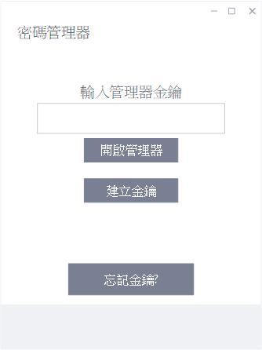
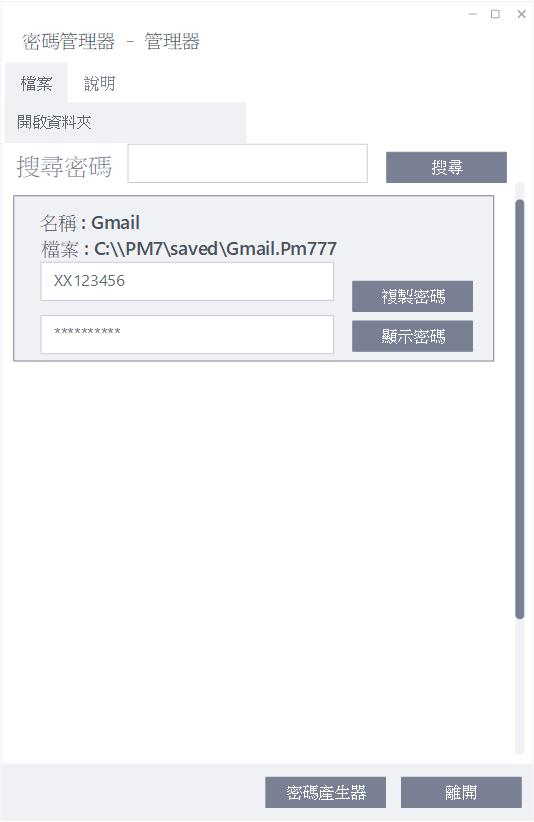

# PasswordManager_No.7
幫你管理、保存密碼，避免他人無意間看到、直接開啟

## 環境需求
java8以上

## 下載
目前沒有

## 功能
- 以個別檔案加密保存密碼
- 可自訂產生密碼
- 閒置過久自動關閉
- 複製密碼過久自動清除

## 使用介面操作方法
### 選單
於輸入金鑰處填入金鑰再點擊開啟管理器，可進入管理器畫面．
若尚未有金鑰，點選建立金鑰產生一組金鑰供管理器進行加解密．

### 金鑰產生器
進入金鑰產生器後，填入安全性問題的答案後，點擊確認產生金鑰，
並退回選單，金鑰會自動填入選單的金鑰輸入欄中，請記住該組金鑰
以供未來進行操作．
- 註: 記住安全性問題的答案以供未來忘記金鑰時可取回金鑰．

### 管理器畫面
進入管理器後點擊右上角檔案項目點選開啟資料夾載入資料夾下的所有
密碼檔案，只有能夠以金鑰解碼的檔案會被開啟．
使用時可利用滾輪捲軸尋找欲使用的密碼檔案，也可利用上方搜尋欄填入名稱
進行搜尋．
預設的密碼顯示為遮罩過的結果，使用時點選複製密碼或是顯示密碼操作
兩個文字顯示欄中上方的為帳號，而下方為密碼．
若要加入產生密碼檔案，可點選下方密碼產生器．

### 密碼產生器
進入密碼產生器後，若已有密碼，可直接填入密碼欄位，將檔案名稱及帳號欄位
填入後即可點擊下方返回並保存，管理器會將這個檔案加密保存．
若還未有密碼，講檔案名稱及帳號欄位填入後，可根據要求選擇產生密碼的規範，
填入需求的密碼長度後按下產生密碼即可生成一組密碼於密碼欄位，可按下顯示密碼
查看生成的密碼或是修改規範重新生成密碼，完成後點選返回並保存將密碼檔案保存．

## 待辦事項
- 金鑰產生
- 檔案加解密
- 密碼產生
- 自動清除功能
- 金鑰尋回功能
