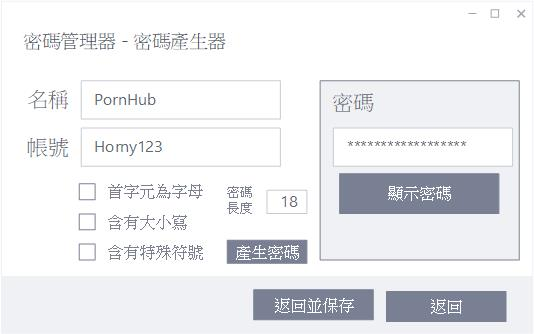

# PasswordManager_No.7
幫你管理、保存密碼，避免他人無意間看到、直接開啟

## 環境需求
java8以上

## 下載
目前沒有

## 目的
- 對保存密碼的檔案加密
  - AES-KDF
- 自動產生密碼
  - 自訂演算法
  - 亂數
- 密碼管理器閒置一段時間後自動關閉
- 複製密碼時經過幾秒後刪除複製的密碼
- 忘記開啟密碼管理器時使用的密鑰時有方式可取回
  - 安全性問題

## 運用函式庫
- GUI函式庫
  - javax.swing
- AES函式庫
  - javax.crypto

## 使用介面

## 流程
- 程式關閉流程

  

- 密碼加入流程

  

- 密碼生成流程

  

- 密碼總流程

  

## 預期規劃開發進度
1. [ ] 制定架構
2. [ ] UI設計
3. [ ] 系統開發
4. [ ] 測試
